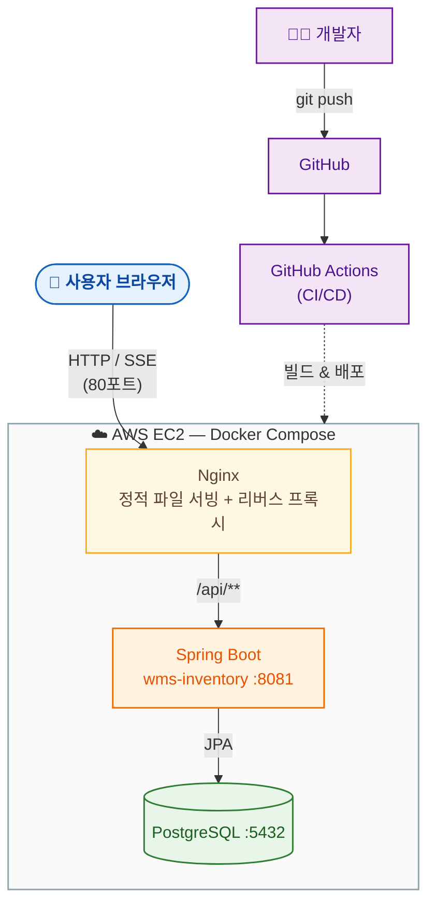
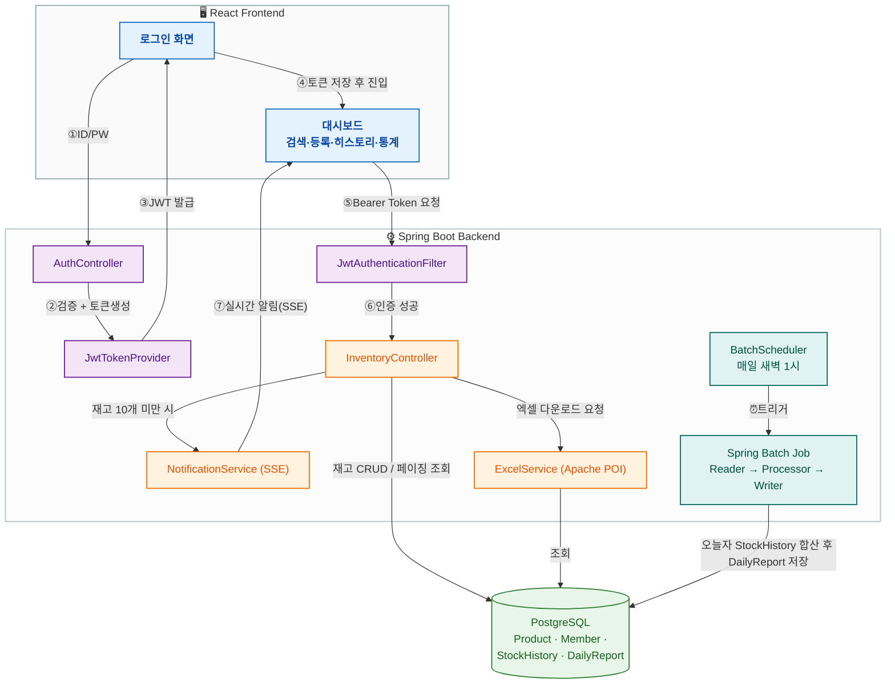

# 📦 WMS Inventory Management System
**Spring Boot & React를 활용한 MSA 기반의 실시간 재고 관리 프로젝트**

## 🏗 System Overview
본 프로젝트는 서비스 확장성과 유지보수성을 고려하여 **Microservices Architecture(MSA)**를 채택하였으며, **AWS EC2** 환경 위에서 **Docker**를 통해 개발/운영 환경을 표준화하였습니다.

## 🔄 Architecture & Flow

### 1) 배포 아키텍처 (Infra)

### 2) 애플리케이션 요청 흐름

> **흐름 요약**: 로그인(JWT 발급) → 모든 API 요청은 `JwtAuthenticationFilter`에서 토큰 검증 → 재고 변경 시 `@Version` 낙관적 락으로 동시성 제어 + `StockHistory` 기록 → 재고 10개 미만이면 SSE로 실시간 알림 → 매일 새벽 1시 Spring Batch가 하루치 `StockHistory`를 정산해 `DailyReport`로 적재.

## 🛠 Tech Stack & Architecture
프로젝트에 적용된 기술 스택과 MSA 구성 요소입니다.

| 구분 | 주요 기술 | 역할 및 구현 내용 |
| :--- | :--- | :--- |
| **Cloud** | **AWS EC2** | 클라우드 기반 인프라 호스팅 및 네트워크 관리 |
| **Infrastructure** | **Docker, Docker Compose** | 컨테이너 격리 및 서비스 통합 관리 |
| **CI/CD** | **GitHub Actions** | 자동화된 빌드 및 배포 파이프라인  |
| **Backend** | Java 21, Spring Boot 3.2 | RESTful API, 동시성 제어(Optimistic Lock) |
| **Frontend** | React (Vite), Nginx | 컴포넌트 기반 UI, SSE 기반 실시간 상태 갱신 |
| **Database** | PostgreSQL | 관계형 DB 설계 및 Docker Volume 영속성 관리 |
| **Util/Batch** | Apache POI, Spring Batch | 엑셀 리포트 자동 생성 및 대량 데이터 처리 |

## 💡 Key Features & Troubleshooting
* **동시성 제어**: `@Version` 필드를 활용한 낙관적 락(Optimistic Lock) 구현으로 데이터 무결성 보장.
* **실시간 대시보드**: Nginx 역방향 프록시 설정을 통한 **SSE(Server-Sent Events)** 연결 최적화.
* **데이터 영속성**: Docker Volume 설정을 통해 컨테이너 재시작 시에도 데이터 유실 방지.
* **인프라 및 운영 트러블슈팅**:
    * **배포 표준화**: 환경 파편화 문제를 해결하기 위해 도커라이징을 통한 빌드/배포 자동화 파이프라인 구축.
    * **DB 스키마 및 마이그레이션**: SQL 프로시저를 활용한 대규모 테스트 데이터(1,000건+) 자동 생성 스크립트 작성.
    * **운영 환경 대응**: 인스턴스 IP 변경 및 컨테이너 생명주기에 따른 서비스 안정성 관리 방안 수립.

## 🚀 Deployment & Maintenance
배포/운영 구조는 위 [배포 아키텍처 다이어그램](#1-배포-아키텍처-infra)을 참고하세요. AWS EC2 위에서 Docker Compose로 컨테이너를 표준화하고, GitHub Actions로 빌드·배포를 자동화합니다.
